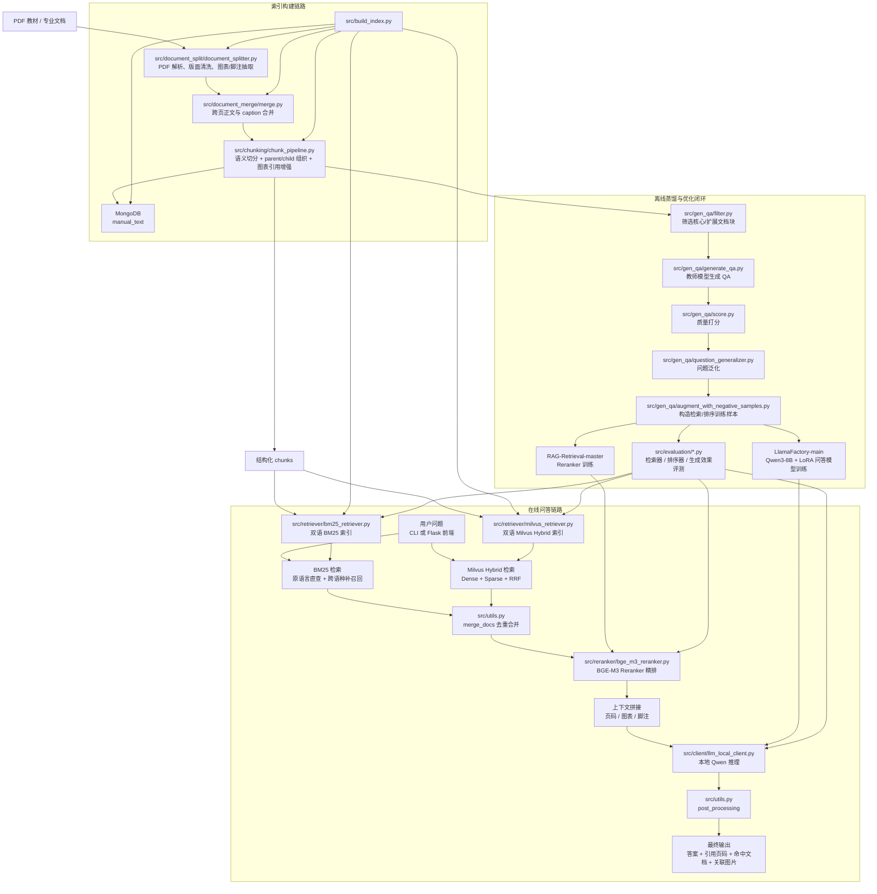

# IR-RAG-System 流程图

下面的流程图基于当前仓库的真实代码链路整理，重点覆盖三部分：

- 在线问答主链路：`main.py`、`ir_rag_chat_frontend/app.py`
- 文档构建与索引更新链路：`src/build_index.py`
- 离线数据蒸馏与评测链路：`src/gen_qa/`、`src/evaluation/`

## 简化理解

1. 文档先经过 `解析 -> 清洗 -> 跨页修复 -> 语义切分`，形成可检索的结构化 chunk。
2. chunk 一路写入 MongoDB，另一路分别进入双语 BM25 和双语 Milvus。
3. 在线问答时，系统并行做 BM25 与 Milvus 召回，合并后再用 reranker 精排。
4. 精排后的上下文送入本地大模型生成答案，最后补齐页码、命中文档和图表引用。
5. 离线部分再基于 chunk 自动生成 QA、做问题泛化、构造训练集，用于持续优化问答模型和 reranker。

## 对应代码入口

- 在线问答主入口：[main.py](/hard_data1/user/yangguobin/LLM/IR-RAG-System-main/main.py)
- Web 前端入口：[ir_rag_chat_frontend/app.py](/hard_data1/user/yangguobin/LLM/IR-RAG-System-main/ir_rag_chat_frontend/app.py)
- 文档构建入口：[src/build_index.py](/hard_data1/user/yangguobin/LLM/IR-RAG-System-main/src/build_index.py)
- Milvus 检索器：[src/retriever/milvus_retriever.py](/hard_data1/user/yangguobin/LLM/IR-RAG-System-main/src/retriever/milvus_retriever.py)
- BM25 检索器：[src/retriever/bm25_retriever.py](/hard_data1/user/yangguobin/LLM/IR-RAG-System-main/src/retriever/bm25_retriever.py)
